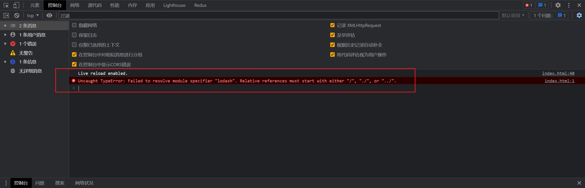
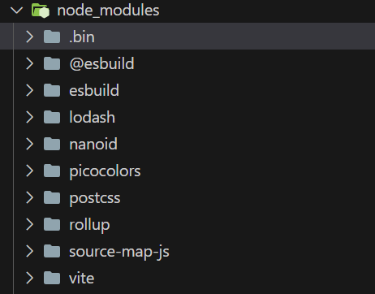

- 为什么esmodule默认情况下不会去node_modules查找，如图所示？

答：这样做就失去了模块化的意义，假设esmodule默认支持，那么当我们引入loadsh这个包时，还需要加载loadsh用到的所有包。

  解决方法：使用`vite、webpack等构建工具`

- 运行前

    

- 运行后


这样加载出了 `lodash`


- 问：vite的优势：

  答：

  1. 开箱即用：不需要配置任何额外的东西就可以使用vite


# 预加载

## vite的路径补全

```js
// 补全前
import _ from 'lodash'
	
// 补全后
import __vite__cjsImport0_lodash from "/node_modules/.vite/deps/lodash.js?v=051aef93";

```

## vite引入cjs的包

### 依赖预构建

- 是什么？

  首先`vite`会找到对应的依赖，调用`esbuild`将其他规范的代码转成`esmodule`规范，然后放到`/nodue_modules/.vite/deps`下

- 解决了什么问题？

  1. 适配各种规范的包
  2. 方便包的路径处理
  3. 网络多包传输的性能


### 取消依赖构建

```js
// vite.config.js
export default {
  optimizeDeps: {
    exclude: ['lodash-es']
  }
}

```


